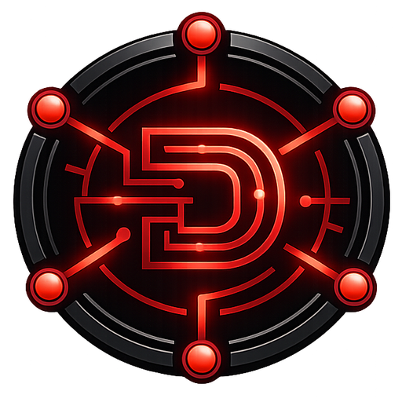

<p align="center">
  
</p>

# dlvault

Media-library automation for Plex and Jellyfin. Tracks your Trakt or
Plex watchlist, downloads new entries via JDownloader, then renames
and organizes them into your library — marks Trakt as collected,
deduplicates against what you already own, runs entirely on your own
hardware.

dlvault is a **plugin host** — the core ships with zero bundled sources.
You install the source plugins you want. The setup wizard offers the
official **[Internet Archive](https://archive.org) reference plugin**
on first run (~6,000 public-domain feature films via direct download).
See [docs/EXAMPLE-PLUGINS.md](docs/EXAMPLE-PLUGINS.md) for other legal
reference implementations.

---

## Features

- **Watchlist sync** — Plex & Trakt watchlists, automatic reconciliation
- **JDownloader integration** — push links, control downloads, speed limit
- **Post-processing** — extract, rename via templates, move into library
- **Series support** — season / episode tracking with per-show quality preferences
- **Plex / Jellyfin sync** — avoid duplicates, detect already-owned content
- **Activity dashboard** — sync metrics, recent activity
- **Telegram bot** (optional) — `/search` from chat, download triggers, notifications
- **Bandwidth scheduling** — time-based speed limits
- **Automatic backups** — SQLite snapshots on a schedule
- **One-click updates** — update banner in dashboard, live progress
- **Setup wizard** — guided first-run configuration

---

## Quick start

```bash
docker run -d --name dlvault --restart unless-stopped \
  -p 3000:3000 \
  -e HOST_DATA_DIR=/path/to/data \
  -v /path/to/data:/app/data \
  -v /path/to/logs:/app/logs \
  -v /path/to/downloads:/downloads \
  -v /path/to/movies:/movies \
  -v /path/to/series:/series \
  -v /var/run/docker.sock:/var/run/docker.sock \
  ghcr.io/dlvault/dlvault:latest
```

`HOST_DATA_DIR` must match the host-side path of the `/app/data` volume —
it's what the one-click updater uses to share progress with the main
container. Mounting the Docker socket is what lets the dashboard's
"Update" button replace the running container.

Or with Docker Compose:

```bash
docker compose up -d
```

Local paths via `docker-compose.override.yml` (not committed):

```yaml
services:
  dlvault:
    environment:
      - HOST_DATA_DIR=/mnt/user/appdata/dlvault/data
    volumes:
      - /mnt/user/appdata/dlvault/data:/app/data
      - /mnt/user/Downloads:/downloads
      - /mnt/user/Mediathek/Filme:/movies
      - /mnt/user/Mediathek/Serien:/series
```

Open **http://localhost:3000** — the setup wizard launches on first start.

### Environment variables

| Variable | Default | Description |
|---|---|---|
| `PORT` | `3000` | HTTP port |
| `NODE_ENV` | `production` | Environment |
| `HOST_DATA_DIR` | — | **Required for one-click updates** — host path to the `/app/data` volume |
| `API_TOKEN` | — | Bearer token for API authentication |
| `CORS_ORIGIN` | — | Allowed CORS origins |
| `UPDATE_CHECK_REPO` | `dlvault/dlvault` | GitHub repo polled for new versions |
| `MAIN_CONTAINER` | `dlvault` | Container name (for the updater's `docker stop/run`) |
| `MAIN_IMAGE` | `ghcr.io/dlvault/dlvault:latest` | Image ref the updater pulls |
| `UPDATER_IMAGE` | `ghcr.io/dlvault/dlvault-updater:latest` | Sidecar updater image |
| `PUID` | `99` | UID the app process runs as. Default matches Unraid's `nobody`. Set to your host user's UID on non-Unraid hosts. |
| `PGID` | `100` | GID the app process runs as. Default matches Unraid's `users`. |

### Volumes

| Container path | Required | Description |
|---|---|---|
| `/app/data` | strongly recommended | SQLite database, accepted plugins, audit log, update status. Declared as `VOLUME` in the image, so Docker silently creates an anonymous volume if you don't bind-mount — your data still persists but lives in `/var/lib/docker/volumes/<hash>/` and is hard to back up or migrate. Bind-mount to a known host path. |
| `/app/logs` | recommended | Application logs. Same story — anonymous volume by default. Bind-mount if you want easy `tail -f` or log retention. |
| `/downloads` | yes | Where JDownloader writes finished downloads. Mount the **same host path** that JDownloader sees, otherwise the post-processor can't find the files. |
| `/movies` | yes | Final movie library (read by Plex / Jellyfin). The post-processor renames + moves completed downloads here. |
| `/series` | yes | Final series library — same idea, season/episode-structured. |
| `/var/run/docker.sock` | required for one-click updates | Lets the updater sidecar pull a new image and recreate the container. Read-only mounts will not work. Without this mount the dashboard still runs but the Update button is disabled. |

`HOST_DATA_DIR` must point at the **host-side** path that you bind-mount to `/app/data`. The updater uses it to share progress between the old and new container during an update — if `/app/data` is on an anonymous volume, one-click updates can't work.

The `JDownloader` "downloads folder" setting **must** point at the same host directory as the `/downloads` mount, otherwise the post-processor sees an empty directory after a download finishes.

---

## How it works

The scheduler watches your watchlist (Trakt or Plex). When a new title
appears, dlvault searches the registered sources for matching releases,
hands the links to JDownloader, and post-processes the completed files
into your library — extract, rename, move, mark Trakt as collected.

Sources are **user-installed plugins**. The core has no built-in
knowledge of any specific source — every download path comes from a
plugin the user has explicitly installed and accepted. Reference
implementations and the plugin author's guide live at
[docs/PLUGIN-AUTHORS.md](docs/PLUGIN-AUTHORS.md);
[docs/EXAMPLE-PLUGINS.md](docs/EXAMPLE-PLUGINS.md) curates a list of
legal source plugins.

### Adding a plugin

In **Settings → Plugins**, paste a plugin's URL, upload a `.dlvault.js`
bundle, or drop one into `data/plugins/` over SFTP / SMB and accept it.
Every install records the file hash and acceptance timestamp in a local
audit log (`data/plugins/disclaimer-log.json`).

---

## Configuration

After the setup wizard, all settings are at **/settings**:

- **Watchlist provider** — Plex (PIN auth) or Trakt (OAuth)
- **Media server** — Plex or Jellyfin URL + API key
- **JDownloader** — My.JDownloader email, password, device name
- **Plugins** — install, enable / disable, per-plugin configuration
- **Plugin Secrets** — API keys / tokens that plugins request via their manifest
- **Paths** — downloads, movies, series
- **Quality** — preferred / minimum quality, audio preference
- **Telegram bot** (optional) — bot token, allowed chat IDs
- **Post-processing** — extract, rename templates (`{title}`, `{year}`, `{quality}`, `{season}`)
- **Backups** — schedule, retention
- **Bandwidth** — speed limit with schedule

---

## UI

| Route | Page | Description |
|---|---|---|
| `/` | Dashboard | Sync status, statistics, recent activity |
| `/movies` | Queue | Tracked movies/shows with status and retry |
| `/downloads` | Downloads | JDownloader packages, links, speed control |
| `/library` | Library | Plex/Jellyfin library view + import |
| `/settings` | Settings | Full configuration |
| `/logs` | Logs | Activity log with filters |

---

## Update

The dashboard shows an **Update** banner when a new commit lands on
`UPDATE_CHECK_REPO`. One click pulls the new image from
`ghcr.io/dlvault/dlvault:latest`, swaps the container, runs a health check,
and rolls back on failure. Progress streams live to the UI.

### Automatic updates with Watchtower (optional)

If you'd rather not click a button, add
[Watchtower](https://containrrr.dev/watchtower/) to your compose stack.
dlvault's image already carries the `com.centurylinklabs.watchtower.enable`
label, so Watchtower will pick it up:

```yaml
services:
  watchtower:
    image: containrrr/watchtower
    restart: unless-stopped
    volumes:
      - /var/run/docker.sock:/var/run/docker.sock
    command: --label-enable --cleanup --interval 3600
```

This polls the registry hourly and silently updates dlvault (and any other
container with the same label) to the latest image. dlvault's built-in
update button still works in parallel — both pull from the same place.

---

## Development

```bash
# Backend + frontend in parallel
npm run dev:all

# Backend only
npm run dev

# Frontend only
npm run dev:frontend

# Build
npm run build && npm run build:frontend

# Test
npm test
```

Stack: Node.js 22, Express 5, TypeScript, Vue 3, Pinia, Vite,
better-sqlite3 (WAL), Docker multi-stage build.

See [CONTRIBUTING.md](CONTRIBUTING.md) before opening a PR.

---

## License

[AGPL-3.0](LICENSE) — GNU Affero General Public License v3.0. If you
run a modified version of dlvault that interacts with users over a
network, you must make the modified source available to those users
(the "network use" copyleft clause).

---

## Disclaimer

dlvault is provided "as is" under AGPL-3.0. Users are responsible for
how they configure the software and which plugins they install, and
for complying with the laws of their jurisdiction.
